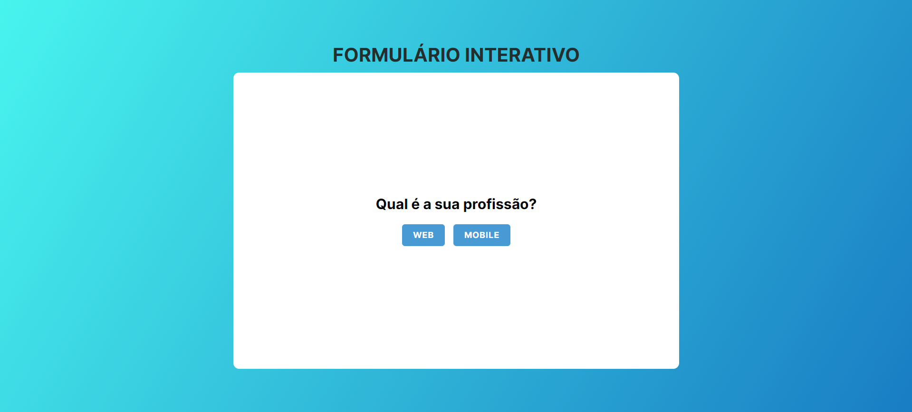
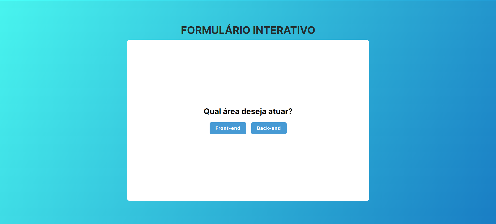
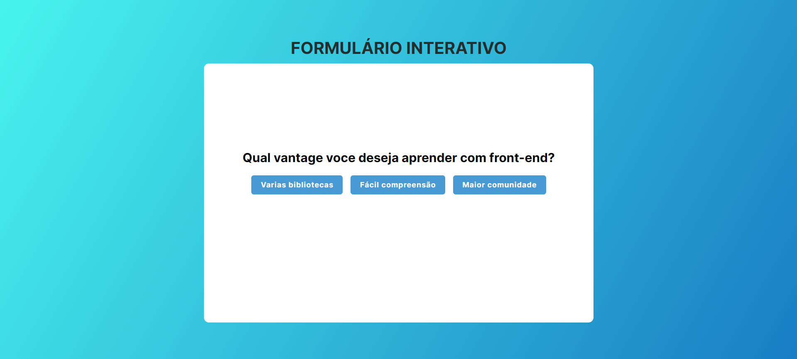
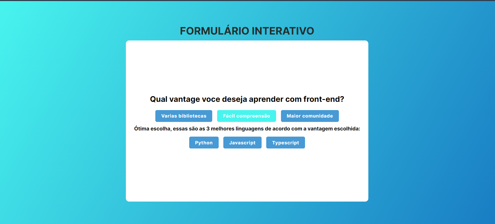

# Formulário Interativo

Este é um projeto de formulário interativo desenvolvido com HTML, CSS e JavaScript. Ele permite aos usuários selecionar a opção desejada de forma dinâmica e interativa.

## Imagens das funcionalidades do projeto










## Funcionalidades

- Formulario com multipla escolha
- Estilo visual aprimorado com CSS
- Interatividade com JavaScript
  

## Estrutura do Projeto

```
interactive-form/
├── image
├── index.html
├── README.md
├── script.js
└── style.css
```

## Como Usar

1. **Clone o repositório**

   ```bash
   git clone https://github.com/Leandro-Pinho/interactive-form.git
   cd interactive-form
   ```

2. **Abra o arquivo `index.html` em seu navegador**

   Você pode simplesmente abrir o arquivo `index.html` diretamente no navegador ou usar um servidor local para servir o projeto.


## Contribuição

1. Faça um fork do projeto
2. Crie um branch para sua feature (`git checkout -b feature/nova-feature`)
3. Commit suas mudanças (`git commit -am 'Adiciona nova feature'`)
4. Envie para o branch (`git push origin feature/nova-feature`)
5. Crie um novo Pull Request

## Licença

Este projeto está licenciado sob a licença MIT. Veja o arquivo LICENSE para mais detalhes.
